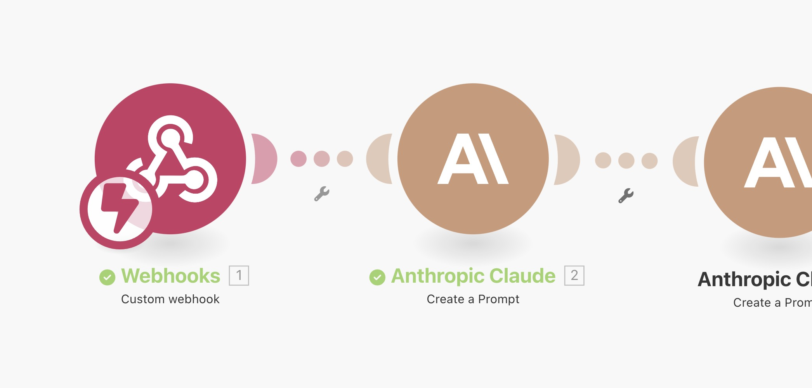
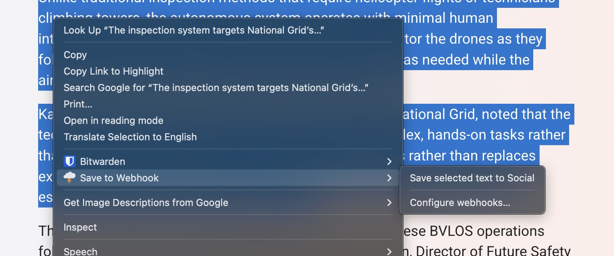

# Save to Make.com Webhook - Chrome Extension

A Chrome extension that saves webpage content directly to Make.com webhooks. Designed for marketing teams, researchers, and content creators who need to quickly capture and organize web content into automated Make.com workflows.

## Why Use This Extension?



Modern marketing and research workflows require capturing content from across the web - competitor analysis, trend research, content inspiration, and lead intelligence. This extension bridges the gap between manual content discovery and automated processing with Make.com.

By connecting directly to [Make.com](https://www.make.com/en/register?pc=stirtingale) webhooks, you can instantly route captured content into your existing tools: CRM systems, content calendars, team collaboration platforms, and knowledge bases. Instead of copy-pasting into spreadsheets or taking screenshots, content flows directly into your Make.com scenarios with rich metadata preserved.

**Marketing Team Workflow Example:**
A marketing manager researching competitors can right-click competitor blog posts → route to "Competitor Analysis" Make.com webhook → automatically populate Google Sheets with content, images, and metadata → trigger Slack notifications to the team → create tasks in project management tools.

## Features

- **Multiple Make.com webhook support** - Configure different Make.com endpoints for different workflows
- **Right-click context menus** - Save content directly from any webpage to Make.com
- **Three save modes** - Full page, selected text, or links sent to Make.com
- **Rich metadata extraction** - Includes Open Graph images and metadata for Make.com processing
- **Management interface** - Easy Make.com webhook configuration
- **Cross-device sync** - Settings sync across Chrome browsers

## Installation

1. Download this repository
2. Open Chrome → `chrome://extensions/`
3. Enable **Developer mode** (top-right toggle)
4. Click **Load unpacked** → select the extension folder
5. Configure webhooks via the options page

## Configuration

### Adding Make.com Webhooks

Access Make.com webhook management via:

- Right-click any webpage → "Configure webhooks..."
- Click extension icon → "Setup Webhooks"
- Chrome extensions page → Extension details → "Extension options"

Add Make.com webhooks with a descriptive name and URL:

- **Name**: "Research Notes"
- **URL**: `https://hook.us1.make.com/abc123...`

### Make.com Integration

[Make.com](https://www.make.com/en/register?pc=stirtingale) is a visual automation platform that connects apps and services without coding. It's particularly powerful for marketing workflows because it can:

- **Route content intelligently** - Send competitor content to one Make.com scenario, industry news to another
- **Enrich data automatically** - Add sentiment analysis, keyword extraction, or content summarization in Make.com
- **Trigger multi-step workflows** - Save content → Make.com processes → notify team → create calendar events → update CRM
- **Connect to 1000+ apps** - Integrate with Slack, HubSpot, Notion, Airtable, and more through Make.com

#### Make.com Setup Instructions

1. **Create free account** at [Make.com](https://www.make.com/en/register?pc=stirtingale)
2. **Create new scenario** in your Make.com dashboard
3. **Add Webhooks module** → "Custom webhook" in Make.com
4. **Copy the Make.com webhook URL**
5. **Add your next step** (Google Sheets, Slack, etc.) in Make.com
6. **Map webhook data** to your chosen app in Make.com
7. **Activate the Make.com scenario**

#### Make.com + Google Sheets Example

1. Add **Google Sheets** → "Add a row" after the webhook in Make.com
2. **Map fields** in Make.com:
   - Column A: `timestamp`
   - Column B: `url`
   - Column C: `title`
   - Column D: `text`
   - Column E: `webhook_name`
   - Column F: `meta.og_image`
3. **Test and activate** your Make.com scenario

## Usage

### Right-Click Context Menus



- **Single Make.com webhook**: Direct menu items ("Save page to Research Notes")
- **Multiple Make.com webhooks**: Submenus organized by action type
- **No webhooks**: "Configure webhooks..." option to set up Make.com integration

### Popup Interface

1. Click extension icon
2. Select Make.com webhook from dropdown
3. Choose "Save Page" or "Save Selected"

## Data Format

```json
{
  "timestamp": "2025-09-24T10:30:00.000Z",
  "url": "https://example.com/article",
  "title": "Article Title",
  "text": "Content text...",
  "type": "full_page|selected_text|link",
  "method": "context_menu|popup",
  "webhook_name": "Research Notes",
  "meta": {
    "og_image": "https://example.com/image.jpg",
    "og_title": "Article Title",
    "og_description": "Article description",
    "og_site_name": "Site Name",
    "favicon": "https://example.com/favicon.ico"
  }
}
```

## Marketing & Business Use Cases with Make.com

### Competitive Intelligence

- **Monitor competitor content** - Save competitor blog posts, product pages, and campaigns to Make.com for analysis
- **Track pricing changes** - Capture product pages with images, route to Make.com for price monitoring workflows
- **Campaign analysis** - Save ad creatives and landing pages, process through Make.com for creative inspiration databases

### Content Strategy

- **Trend research** - Route trending content through Make.com to research folders organized by topic
- **Content curation** - Collect industry articles with metadata, use Make.com to compile newsletters automatically
- **Social media scheduling** - Save posts with og:image, process through Make.com for cross-platform sharing

### Lead Generation & Sales

- **Prospect research** - Save company information, route through Make.com to CRM systems
- **Industry intelligence** - Track news about prospects, use Make.com to trigger sales team notifications
- **Event monitoring** - Capture conference speakers and attendee information, process through Make.com lead workflows

### Team Collaboration

- **Client research** - Route client-related findings through Make.com to dedicated team channels
- **Project resources** - Organize research by project using named Make.com webhooks
- **Knowledge management** - Build searchable databases through Make.com automation

### Advanced Make.com Workflow Examples

**Multi-step Marketing Workflow:**

1. Save competitor article → [Make.com](https://www.make.com/en/register?pc=stirtingale) webhook
2. **Make.com OpenAI module** - Extract key insights and sentiment
3. **Make.com Google Sheets** - Log with analysis in competitor tracking sheet
4. **Make.com Slack integration** - Alert marketing team with summary
5. **Make.com Asana connector** - Create follow-up task if significant threat detected

**Content Calendar Automation:**

1. Save trending article → Make.com webhook
2. **Make.com content analysis** - Identify trending topics and keywords
3. **Make.com Airtable integration** - Add to content ideas with priority scoring
4. **Make.com calendar sync** - Schedule content creation tasks
5. **Make.com team notifications** - Alert content creators of new opportunities

_Note: While this extension is optimized for Make.com workflows, it can technically work with any webhook endpoint that accepts JSON POST requests._

## File Structure

```
save-to-webhook/
├── manifest.json      # Extension configuration
├── background.js      # Context menus and webhook management
├── popup.html         # Popup interface
├── popup.js          # Popup logic
├── options.html      # Webhook management page
├── options.js        # Webhook CRUD operations
├── content.js        # Content script
└── icons/            # Extension icons (optional)
```

## Permissions

- `activeTab` - Access current tab content
- `storage` - Save webhook configurations
- `contextMenus` - Add right-click options
- `scripting` - Inject content extraction scripts

## Browser Compatibility

Chrome extensions using Manifest V3. Requires Chrome 88+.

## License

MIT License
